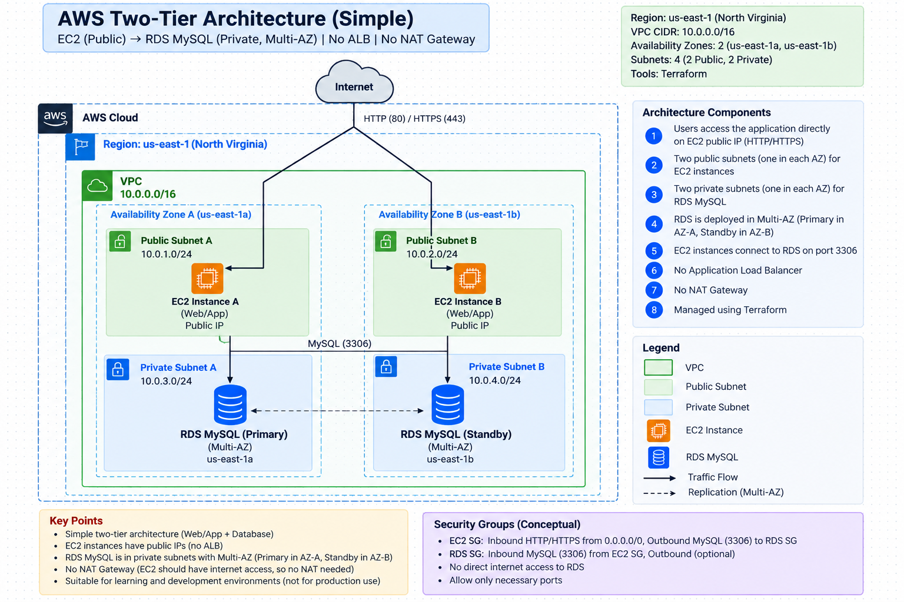
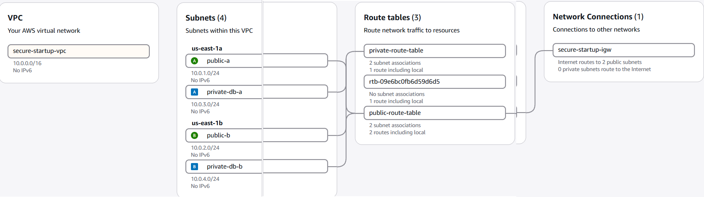
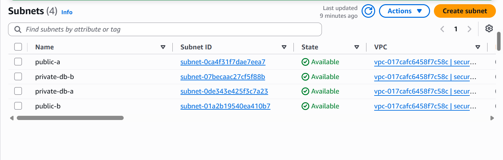
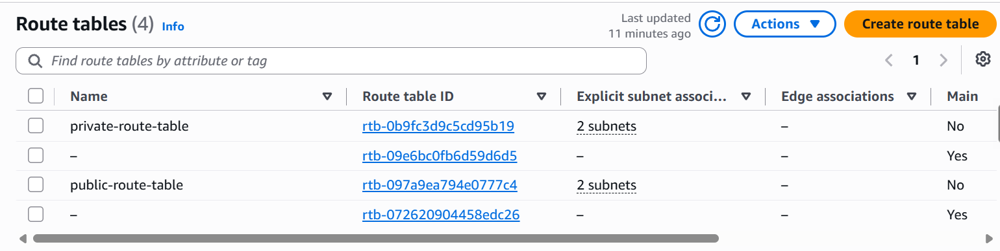
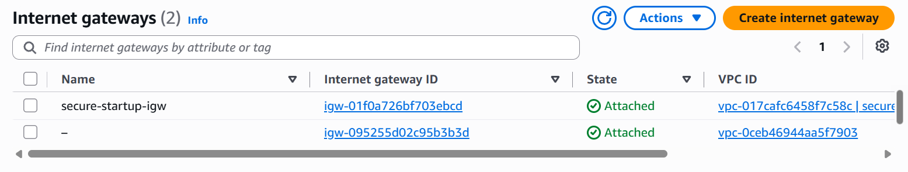
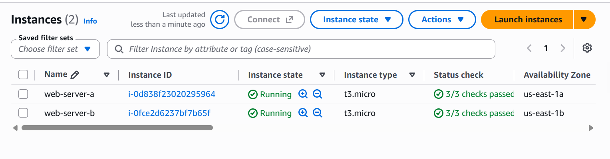
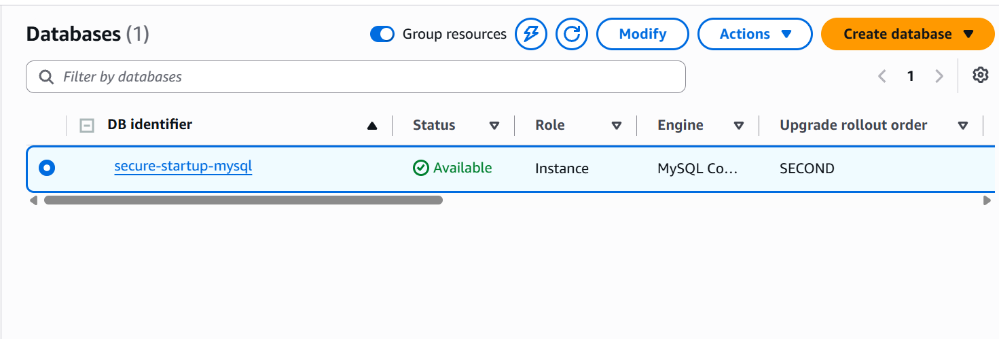
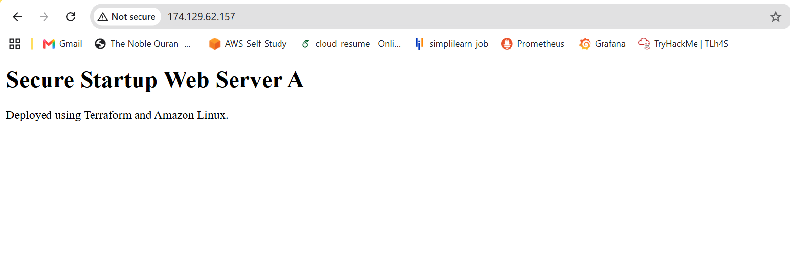
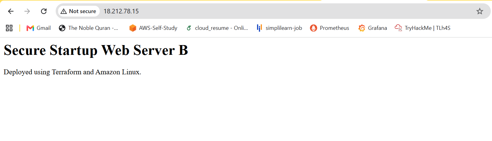

# AWS Two-Tier Infrastructure with Terraform

Infrastructure as Code project that provisions a two-tier AWS architecture using Terraform.

The architecture consists of a VPC distributed across two Availability Zones, public EC2 web servers running Nginx, and a private Multi-AZ Amazon RDS MySQL database.

The infrastructure is fully defined and provisioned using Terraform, with AWS networking, security groups, IAM, compute, and database resources managed as code.

## Architecture



## Architecture Overview

The infrastructure is deployed in the AWS `us-east-1` region across two Availability Zones:

- **Availability Zone 1:** `us-east-1a`
- **Availability Zone 2:** `us-east-1b`

### Network Layout

- **VPC:** `10.0.0.0/16`
- **Public Subnet A:** `10.0.1.0/24`
- **Public Subnet B:** `10.0.2.0/24`
- **Private DB Subnet A:** `10.0.3.0/24`
- **Private DB Subnet B:** `10.0.4.0/24`

### Compute Tier

Two EC2 instances are deployed across separate Availability Zones:

- `web-server-a` → `us-east-1a`
- `web-server-b` → `us-east-1b`

Both instances run **Amazon Linux** with **Nginx** installed automatically through Terraform `user_data`.

### Database Tier

Amazon RDS for MySQL is deployed in the private database subnets with:

- MySQL 8.0
- Multi-AZ enabled
- Storage encryption enabled
- Public accessibility disabled
- 20 GB GP3 storage

### Traffic Flow

```text
Internet
   │
   ▼
Internet Gateway
   │
   ├── Public Subnet A → EC2 Web Server A
   │
   └── Public Subnet B → EC2 Web Server B
                              │
                              │ TCP 3306
                              ▼
                     Private RDS MySQL
```

### AWS Services Used

| Service | Purpose |
|---|---|
| **Amazon VPC** | Provides the isolated network environment |
| **Amazon EC2** | Hosts the web servers running Nginx |
| **Amazon RDS** | Hosts the MySQL database |
| **Internet Gateway** | Provides internet connectivity for the public subnets |
| **Security Groups** | Controls inbound and outbound network traffic |
| **IAM** | Provides permissions for EC2 to access AWS services |
| **Amazon EBS** | Provides block storage for the EC2 instances |
| **Terraform** | Provisions and manages the infrastructure as Code |

### Terraform Resources

The project provisions the following infrastructure resources:

- VPC
- Internet Gateway
- Public and private subnets
- Public and private route tables
- Route table associations
- EC2 security group
- RDS security group
- IAM role
- IAM policy
- IAM role-policy attachment
- IAM instance profile
- Two EC2 instances
- RDS DB subnet group
- RDS MySQL Multi-AZ instance

### Security Design

The infrastructure uses multiple layers of AWS security controls.

#### EC2 Security Group

The EC2 security group allows:

| Protocol | Port | Source | Purpose |
|---|---:|---|---|
| TCP | 80 | `0.0.0.0/0` | HTTP traffic |
| TCP | 443 | `0.0.0.0/0` | HTTPS traffic |
| TCP | 22 | Administrator IP `/32` | SSH administration |

Outbound traffic is allowed to `0.0.0.0/0`.

#### RDS Security Group

The RDS security group allows:

```text
EC2 Security Group → TCP 3306 → RDS
```

## Deployment

### Prerequisites

- AWS account
- Terraform installed
- AWS CLI installed
- Git installed
- AWS credentials configured locally

### Project Structure

```text
aws-2-tier-infrastructure/
├── README.md
├── main.tf
├── provider.tf
├── variables.tf
├── .gitignore
├── .terraform.lock.hcl
├── aws_2_tier_diagram.png
└── screenshots/
    ├── vpc-resource-map.png
    ├── subnets.png
    ├── route-tables.png
    ├── internet-gateway.png
    ├── ec2-instances.png
    ├── rds-mysql.png
    ├── web-server-a.png
    └── web-server-b.png
```

## Testing & Verification

The deployed infrastructure was verified through the AWS Console and browser-based testing.

### EC2 Web Servers

Both EC2 instances were successfully deployed across separate Availability Zones.

- Web Server A → `us-east-1a`
- Web Server B → `us-east-1b`
- Nginx was installed automatically using Terraform `user_data`.
- Both web servers were accessible through their public IP addresses.

### RDS MySQL

The RDS database was verified with the following configuration:

- Engine: MySQL
- Status: `available`
- Multi-AZ: Enabled
- Publicly accessible: Disabled
- Storage encryption: Enabled

### Network Verification

The VPC Resource Map was used to verify:

- Two Availability Zones
- Two public subnets
- Two private database subnets
- Internet Gateway
- Public and private route tables
- EC2 instances in the public subnets
- RDS in the private database subnets

### Verification Evidence

**VPC Resource Map**


**Subnets**


**Route Tables**


**Internet Gateway**


**EC2 Instances**


**RDS MySQL**


**Web Server A**


**Web Server B**


## Lessons Learned

This project provided hands-on experience with:

- Designing a two-tier AWS architecture across multiple Availability Zones.
- Creating VPC networking using Terraform.
- Working with public and private subnets.
- Configuring Internet Gateway and route tables.
- Controlling traffic using Security Groups.
- Using IAM roles and instance profiles instead of storing AWS credentials on EC2.
- Deploying EC2 instances with Terraform `user_data`.
- Deploying a private Multi-AZ RDS MySQL database.
- Managing infrastructure using Terraform as Infrastructure as Code.
- Validating and testing AWS infrastructure after deployment.

## Security Considerations & Limitations

This project focuses on core AWS networking, security, compute, database, and Infrastructure as Code concepts.

The current architecture is **not intended to represent a production-grade deployment**. It is designed to demonstrate the fundamental building blocks of a two-tier AWS environment using Terraform.

### Production-Grade Next Step

A future iteration of this architecture can introduce production-oriented components such as:

```text
                    Internet
                       │
                       ▼
              Application Load
                  Balancer
                 /         \
                ▼           ▼
          Private EC2   Private EC2
             AZ-A          AZ-B
                │           │
                └─────┬─────┘
                      │
                 Private RDS
                  Multi-AZ

          NAT Gateway
          for private
          outbound access
```

## Future Improvements

The next version of this project will focus on evolving the architecture toward a more production-oriented AWS environment.

Planned improvements include:

- Move EC2 instances into private subnets.
- Add an Application Load Balancer (ALB) for traffic distribution.
- Add NAT Gateways for controlled outbound internet access from private subnets.
- Introduce an Auto Scaling Group for the application tier.
- Use AWS Secrets Manager for database credentials.
- Add HTTPS using AWS Certificate Manager.
- Implement CloudWatch monitoring, logging, and alerting.
- Integrate CI/CD for automated infrastructure and application deployments.
- Strengthen network and IAM security controls.